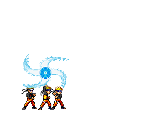
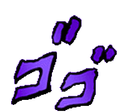
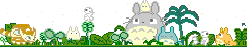

<link href="https://fonts.googleapis.com/css2?family=Press+Start+2P&display=swap" rel="stylesheet">

<h1 align="center">
  
</h1>

  

---

  

    
  

  <h3 style="color: #FFC900; font-family: 'Press Start 2P', monospace; letter-spacing: 2px;">🕹️ About Me: UI Alchemist & Creative Jōnin</h3>

  > 🪄 **UI/UX Alchemist** transmuting wireframes into pure-pixel gold (Ghibli magic).
  > 🧠 **AI Hokage** directing the elemental chakra of Prompt Engineering.
  > ⚙️ **Full Stack Ninja** weaving the threads of front-end and back-end logic.
  > 🌊 **Windsurfing Sorcerer** (Wind-Style Jutsu) — always in motion.
  > 
  > 📜 **My House:** Ravenclaw logic meets Gryffindor audacity.
  > 🌑 Freelancing since 2023—where machine logic and human imagination perform the 'Stand' of creation (Jojo's Bizarre Adventure).
  > 
  > **“If you can imagine it in a One Piece bounty poster, you can code it IRL! Believe it!”**

---

  <h3 style="color: #FFC900; font-family: 'Press Start 2P', monospace; letter-spacing: 2px;">⚔️ Jōnin's Skill Inventory: The Scroll of Tools</h3>

  

    
    
    
    
    
    
  

  
  **Advanced Jutsu (Passive Skills):** 🎞️ Video Editing (CapCut/Resolve) • 📷 Photography • 🎧 Audio Syncing • 🎨 Color Grading • 💡 UI Animation • 🧠 **AI & EdTech Integration**
  
  

    
  

---

  <h3 style="color: #FFC900; font-family: 'Press Start 2P', monospace; letter-spacing: 2px;">🔥 Grand Line Quests: Project Log</h3>

  <table style="width: 100%; border-collapse: collapse; background: rgba(10, 10, 10, 0.7); border: 2px solid #00FFC6;">
    <thead style="background: #282828; color: #73C7FF; font-family: 'Press Start 2P', monospace; font-size: 0.8em;">
      <tr>
        <th style="border: 1px solid #4B4B4B; padding: 12px; text-align: left;">Quest Name</th>
        <th style="border: 1px solid #4B4B4B; padding: 12px; text-align: left;">Objective</th>
        <th style="border: 1px solid #4B4B4B; padding: 12px; text-align: left;">Tech Used</th>
      </tr>
    </thead>
    <tbody style="font-size: 0.8em; color: #B6FF99;">
      <tr>
        <td style="border: 1px solid #4B4B4B; padding: 12px; text-align: left;">🌊 **Flood Detection Jutsu**</td>
        <td style="border: 1px solid #4B4B4B; padding: 12px; text-align: left;">Real-time flood alert system with NodeMCU & ultrasonic sensors</td>
        <td style="border: 1px solid #4B4B4B; padding: 12px; text-align: left;">C++, **IoT Cloud**</td>
      </tr>
      <tr>
        <td style="border: 1px solid #4B4B4B; padding: 12px; text-align: left;">🦯 **Smart Stick (Blind)**</td>
        <td style="border: 1px solid #4B4B4B; padding: 12px; text-align: left;">Navigation aid for the visually impaired (a Bleach-style sensor Zanpakutō)</td>
        <td style="border: 1px solid #4B4B4B; padding: 12px; text-align: left;">**Arduino**, Sensors</td>
      </tr>
      <tr>
        <td style="border: 1px solid #4B4B4B; padding: 12px; text-align: left;">🌱 **Greenhouse Monitoring**</td>
        <td style="border: 1px solid #4B4B4B; padding: 12px; text-align: left;">IoT climate tracking for greenhouses</td>
        <td style="border: 1px solid #4B4B4B; padding: 12px; text-align: left;">**ESP32**, Firebase</td>
      </tr>
      <tr>
        <td style="border: 1px solid #4B4B4B; padding: 12px; text-align: left;">🗣️ **Verbo AI Tutor**</td>
        <td style="border: 1px solid #4B4B4B; padding: 12px; text-align: left;">AI pronunciation tutor inspired by Duolingo</td>
        <td style="border: 1px solid #4B4B4B; padding: 12px; text-align: left;">**Python**, Flask, Figma</td>
      </tr>
    </tbody>
  </table>

---

  <h3 style="color: #FFC900; font-family: 'Press Start 2P', monospace; letter-spacing: 2px;">💫 Chakra Control: My Design Philosophy</h3>

  > **"Creating is an act of Chakra Control: you focus your intent, experiment, and constantly refine the flow until the complex logic and the playful visuals merge into a perfect jutsu. This is the way of the Code Jōnin."**
  
  **🧩 Universe of Skills:**
  
  * 🎨 **Design Realm**: UI/UX • Illustration • Branding • Typography
  * 🎬 **Cinematic Arts**: Video, Photo, **DaVinci Resolve**, CapCut
  * ⚙️ **Tech Craft**: **Full Stack**, Web Dev • IoT • .NET • APIs
  * 🧠 **Creative Code**: **Prompt Engineering**, Animation • **Vibecoding** • EdTech + AI

---

  <h3 style="color: #FFC900; font-family: 'Press Start 2P', monospace; letter-spacing: 2px;">📺 Code Flow Chart: Language Mastery</h3>

  

    
  

---

  

    
  

  <h3 style="color: #FFC900; font-family: 'Press Start 2P', monospace; letter-spacing: 2px;">🌀 Connect & Collaborate: Form a Squad!</h3>
  
  

    
    
    
  

---

  

<h3 align="center" style="color: #FFC900; font-family: 'Press Start 2P', monospace; letter-spacing: 2px;">
  ⚡ **“Press START to activate your Stand and begin the next adventure!”** ⚡
</h3>

