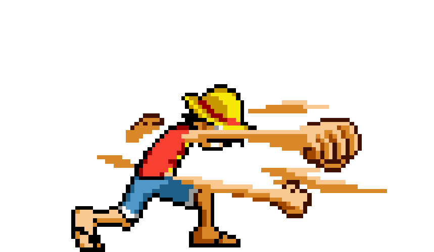

<link href="https://fonts.googleapis.com/css2?family=Press+Start+2P&display=swap" rel="stylesheet">

<h1 align="center">
  
</h1>

  

---

  

    
  

  ### 🕹️ About Me: UI Alchemist & Creative Jōnin

  > 🪄 **UI/UX Alchemist** transmuting wireframes into pure-pixel gold (Ghibli magic).
  > 🧠 **AI Hokage** directing the elemental chakra of Prompt Engineering.
  > ⚙️ **Full Stack Ninja** weaving the threads of front-end and back-end logic.
  > 🌊 **Windsurfing Sorcerer** (Wind-Style Jutsu) — always in motion.
  > 
  > 📜 **My House:** Ravenclaw logic meets Gryffindor audacity.
  > 🌑 Freelancing since 2023—where machine logic and human imagination perform the 'Stand' of creation (Jojo's Bizarre Adventure).
  > 
  > **“If you can imagine it in a One Piece bounty poster, you can code it IRL! Believe it!”**

---

  ### ⚔️ Jōnin's Skill Inventory: The Scroll of Tools

  

    
    
    
    
    
    
  

  
  **Advanced Jutsu (Passive Skills):** 🎞️ Video Editing (CapCut/Resolve) • 📷 Photography • 🎧 Audio Syncing • 🎨 Color Grading • 💡 UI Animation • 🧠 **AI & EdTech Integration**
  
  

    
  

---

  ### 🔥 Grand Line Quests: Project Log

  | Quest Name | Objective | Tech Used |
  |------------|-------------|-----------|
  | 🌊 **Flood Detection Jutsu** | Real-time flood alert system with NodeMCU & ultrasonic sensors | C++, **IoT Cloud** |
  | 🦯 **Smart Stick (Blind)** | Navigation aid for the visually impaired (a Bleach-style sensor Zanpakutō) | **Arduino**, Sensors |
  | 🌱 **Greenhouse Monitoring** | IoT climate tracking for greenhouses | **ESP32**, Firebase |
  | 🗣️ **Verbo AI Tutor** | AI pronunciation tutor inspired by Duolingo | **Python**, Flask, Figma |

---

  ### 💫 Chakra Control: My Design Philosophy

  > **"Creating is an act of Chakra Control: you focus your intent, experiment, and constantly refine the flow until the complex logic and the playful visuals merge into a perfect jutsu. This is the way of the Code Jōnin."**
  
  **🧩 Universe of Skills:**
  
  * 🎨 **Design Realm**: UI/UX • Illustration • Branding • Typography
  * 🎬 **Cinematic Arts**: Video, Photo, **DaVinci Resolve**, CapCut
  * ⚙️ **Tech Craft**: **Full Stack**, Web Dev • IoT • .NET • APIs
  * 🧠 **Creative Code**: **Prompt Engineering**, Animation • **Vibecoding** • EdTech + AI

---

  ### 📺 Retro Console Stats: The HP Bar

  

    
  

---

  

    
  

  ### 🌀 Connect & Collaborate: Form a Squad!
  
  

    
    
    
  

---

  

<h3 align="center">
  ⚡ **“Press START to activate your Stand and begin the next adventure!”** ⚡
</h3>